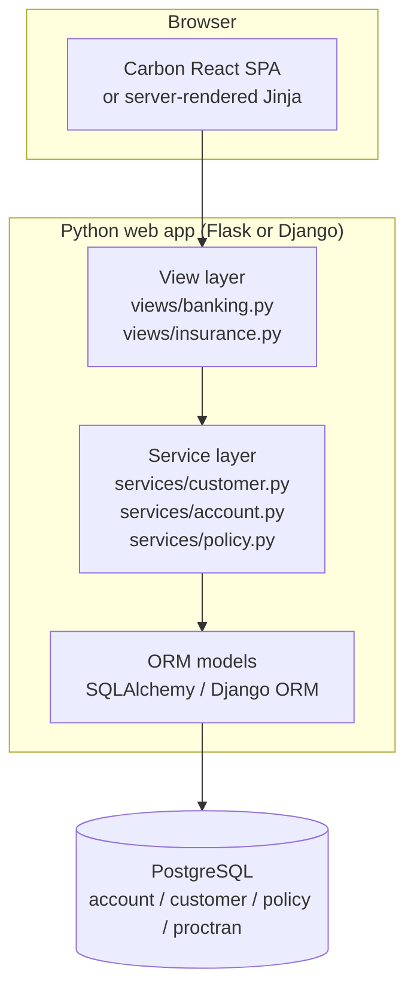
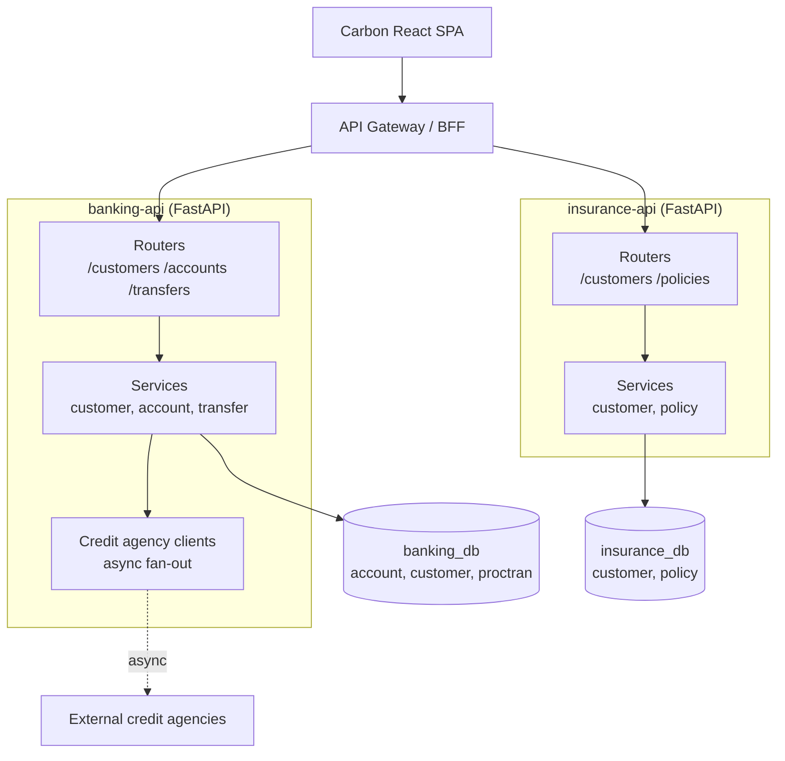
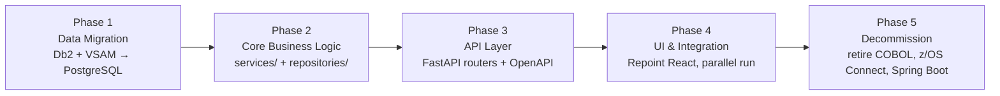

# Software Design Document — COBOL to Python Modernization

> **SDLC Artifact:** Software Design Document (SDD)
> **Programs in scope:** CBSA (CICS Bank Sample Application) + GenApp (CICS General Insurance Application)
> **Target language / runtime:** Python 3.12 + FastAPI + PostgreSQL
> **Status:** Draft v0.1 — for architecture review
> **Last updated:** 2026-05-14

---

## 1. Document Control

| Field             | Value                                                                                       |
| ----------------- | ------------------------------------------------------------------------------------------- |
| Project name      | CBSA + GenApp COBOL → Python Modernization                                                  |
| SDLC stage        | Design                                                                                      |
| Document type     | Software Design Document (SDD)                                                              |
| Source-of-truth   | This repository (`Francisco-Reveriano/COBOL_to_PYTHON`, branch `main`)                      |
| Related artifacts | `README.md`, `doc/CBSA_Architecture_guide.md`, `doc/project_plan/CBSA_Initial_Project_Plan.md`, `cics-genapp/base/Architecture.md` |
| Approval gate     | Architecture Review Board (ARB) sign-off before Phase 1 implementation                      |

### Revision history

| Version | Date       | Author | Notes                                                              |
| ------- | ---------- | ------ | ------------------------------------------------------------------ |
| 0.1     | 2026-05-14 | Devin  | Initial draft: current-state inventory, three target architectures, recommendation, mapping table, migration plan |

---

## 2. Purpose and Scope

This document captures the **as-is software architecture** of the COBOL workloads currently in this repository (CBSA banking and GenApp insurance) and proposes a **to-be architecture in Python**. It is intended to support the Architecture Review Board (ARB) decision on which target topology to pursue, and to give engineering a concrete blueprint that can be sliced into work packages.

**In scope**

- Full inventory of every CICS-callable COBOL program, copybook, and BMS map in:
  - `src/base/cobol_src/`, `src/base/cobol_copy/`, `src/base/bms_src/` (CBSA)
  - `cics-genapp/base/src/` (GenApp)
- Data stores: Db2 tables (`ACCOUNT`, `CONTROL`, `PROCTRAN`, `POLICY`, `CUSTOMER` Db2 variant) and VSAM files (`CUSTOMER` KSDS, `ABNDFILE`, GenApp VSAM customer/policy files).
- Existing modern interfaces on top of the COBOL backend:
  - z/OS Connect API definitions in `src/zosconnect_artefacts/`
  - Spring Boot REST gateways in `src/Z-OS-Connect-Customer-Services-Interface/` and `src/Z-OS-Connect-Payment-Interface/`
  - Carbon React UI in `src/bank-application-frontend/` and `src/webui/`
- Three candidate target architectures in Python and a recommendation.
- Program-by-program mapping to Python modules.
- Phased migration strategy.

**Out of scope**

- Mainframe decommissioning / DR planning (covered separately by Infrastructure).
- Network/firewall topology, identity provider integration, and observability stack (deferred to a separate Operational Design Document).
- Final selection of cloud provider, Kubernetes flavor, or hosted Postgres vendor.

---

## 3. Current State Analysis

### 3.1 Repository topology

The repository is composed of two independently-installable COBOL applications that share a common runtime (CICS TS + Db2 + VSAM) and a common modernization story (REST APIs + React UI):

```
COBOL_to_PYTHON/
├── src/                              # CBSA — banking
│   ├── base/
│   │   ├── cobol_src/                # 29 .cbl files (banking business logic)
│   │   ├── cobol_copy/               # 37 .cpy files (record / map / DB2 / API layouts)
│   │   └── bms_src/                  # 9 .bms files (3270 screens)
│   ├── zosconnect_artefacts/         # z/OS Connect API definitions
│   ├── Z-OS-Connect-Customer-Services-Interface/   # Spring Boot REST gateway
│   ├── Z-OS-Connect-Payment-Interface/             # Spring Boot REST gateway
│   ├── webui/                        # Jakarta EE WAR shell for Carbon UI
│   └── bank-application-frontend/    # React + Carbon Design System SPA
└── cics-genapp/base/
    └── src/                          # 31 .cbl, 13 .cpy, 1 .bms (insurance)
```

### 3.2 COBOL program inventory

The repository contains **60 COBOL programs**, **50 copybooks**, and **10 BMS maps** in total. Of those, **55 programs are production business logic** (the remainder — `BANKDATA`, `LGSETUP`, `LGSTSQ`, `LGTESTC1`, `LGTESTP1–4` — are data-load, queue-stub, and harness utilities used only during installation and testing) and **42 copybooks are functional record / API layouts** (the other 8 are debugging or auxiliary stubs such as `WAZI`, `ABNDINFO`, `RESPSTR`, and the GenApp `pollook.cpy` / `polloo2.cpy` lookup tables consumed only by `LGTEST*`). All **10 BMS maps** are user-facing screens.

#### 3.2.1 CBSA — `src/base/cobol_src/` (29 programs)

| Layer            | Program       | Role                                                                                       |
| ---------------- | ------------- | ------------------------------------------------------------------------------------------ |
| Presentation     | `BNKMENU`     | Main BMS menu — receives `OMEN` transaction, dispatches to screen handlers                  |
| Presentation     | `BNK1CAC`     | BMS handler — Create Account screen                                                         |
| Presentation     | `BNK1CCA`     | BMS handler — Credit/Debit Account screen                                                   |
| Presentation     | `BNK1CCS`     | BMS handler — Create Customer screen                                                        |
| Presentation     | `BNK1CRA`     | BMS handler — Customer Record screen                                                        |
| Presentation     | `BNK1DAC`     | BMS handler — Delete Account screen                                                         |
| Presentation     | `BNK1DCS`     | BMS handler — Delete Customer screen                                                        |
| Presentation     | `BNK1TFN`     | BMS handler — Transfer Funds screen                                                         |
| Presentation     | `BNK1UAC`     | BMS handler — Update Account screen                                                         |
| Business logic   | `CRECUST`     | Create customer — orchestrates async credit check via `CRDTAGY1–5`, writes VSAM CUSTOMER + PROCTRAN |
| Business logic   | `CREACC`      | Create account — increments named counter, writes Db2 ACCOUNT, logs PROCTRAN                |
| Business logic   | `UPDCUST`     | Update customer record in VSAM                                                              |
| Business logic   | `UPDACC`      | Update account row in Db2 ACCOUNT                                                           |
| Business logic   | `DELACC`      | Delete account from Db2 ACCOUNT, log PROCTRAN                                               |
| Business logic   | `DELCUS`      | Delete customer (cascades to accounts via `INQACCCU` + `DELACC`)                            |
| Business logic   | `INQCUST`     | Inquire single customer (VSAM)                                                              |
| Business logic   | `INQACC`      | Inquire account by account number (Db2)                                                     |
| Business logic   | `INQACCCU`    | Inquire all accounts for a customer (Db2 cursor)                                            |
| Business logic   | `XFRFUN`      | Transfer funds — debits source account, credits target account, logs PROCTRAN, syncpointed  |
| Business logic   | `DBCRFUN`     | Debit/credit function — single-account money movement                                       |
| Business logic   | `CRDTAGY1`–`CRDTAGY5` | Five credit agency simulators invoked asynchronously by `CRECUST`                  |
| Utility          | `GETCOMPY`    | Return company name (configuration lookup)                                                  |
| Utility          | `GETSCODE`    | Return sort code (configuration lookup)                                                     |
| Utility          | `ABNDPROC`    | Abend handler — writes failure record to `ABNDFILE` VSAM                                    |
| Setup            | `BANKDATA`    | Bulk test-data loader (not invoked from business flows)                                     |

#### 3.2.2 GenApp — `cics-genapp/base/src/` (31 programs)

| Layer            | Program       | Role                                                                                       |
| ---------------- | ------------- | ------------------------------------------------------------------------------------------ |
| Presentation     | `LGWEBST5`    | Web/SOAP stub — invoked by `ssmap.bms` and HTTP entry points                                |
| Façade           | `LGACUS01`    | Add customer — dispatches to Db2 (`LGACDB01`/`LGACDB02`) or VSAM (`LGACVS01`)               |
| Façade           | `LGICUS01`    | Inquire customer — dispatches to Db2 (`LGICDB01`) or VSAM (`LGICVS01`)                      |
| Façade           | `LGUCUS01`    | Update customer — dispatches to Db2 (`LGUCDB01`) or VSAM (`LGUCVS01`)                       |
| Façade           | `LGAPOL01`    | Add policy — dispatches to Db2 (`LGAPDB01`) or VSAM (`LGAPVS01`)                            |
| Façade           | `LGIPOL01`    | Inquire policy — dispatches to Db2 (`LGIPDB01`) or VSAM (`LGIPVS01`)                        |
| Façade           | `LGUPOL01`    | Update policy — dispatches to Db2 (`LGUPDB01`) or VSAM (`LGUPVS01`)                         |
| Façade           | `LGDPOL01`    | Delete policy — dispatches to Db2 (`LGDPDB01`) or VSAM (`LGDPVS01`)                         |
| Data — Db2       | `LGACDB01`, `LGACDB02`, `LGICDB01`, `LGUCDB01`, `LGAPDB01`, `LGIPDB01`, `LGUPDB01`, `LGDPDB01` | Db2-specific CRUD per entity   |
| Data — VSAM      | `LGACVS01`, `LGICVS01`, `LGUCVS01`, `LGAPVS01`, `LGIPVS01`, `LGUPVS01`, `LGDPVS01` | VSAM-specific CRUD per entity              |
| Utility          | `LGASTAT1`    | Statistics writer                                                                           |
| Utility          | `LGSTSQ`      | Transient data / TSQ writer used by error paths                                             |
| Setup / Test     | `LGSETUP`, `LGTESTC1`, `LGTESTP1`–`LGTESTP4` | Bulk data setup and test drivers (not part of online flows)  |

### 3.3 Data stores

| Store               | Type                  | Contents                                                                              | Owning programs                              |
| ------------------- | --------------------- | ------------------------------------------------------------------------------------- | -------------------------------------------- |
| `CUSTOMER`          | VSAM KSDS             | Customer master (CBSA) — name, address, DOB, credit score                             | `CRECUST`, `UPDCUST`, `INQCUST`, `DELCUS`    |
| `ABNDFILE`          | VSAM ESDS             | Abend log written by `ABNDPROC`                                                       | `ABNDPROC`                                   |
| `ACCOUNT`           | Db2 table             | Bank accounts — balance, interest rate, overdraft, last statement date                | `CREACC`, `UPDACC`, `INQACC`, `INQACCCU`, `DELACC`, `XFRFUN`, `DBCRFUN` |
| `CONTROL`           | Db2 table             | Named counters (next account number, next customer number)                            | `CREACC`, `CRECUST`                          |
| `PROCTRAN`          | Db2 table             | Processed-transaction journal — every money movement and CRUD                          | `CREACC`, `DELACC`, `DBCRFUN`, `XFRFUN`, `CRECUST`, `DELCUS` |
| GenApp `CUSTOMER` (Db2) | Db2 table         | Insurance customer master                                                              | `LGACDB01/02`, `LGICDB01`, `LGUCDB01`         |
| GenApp `POLICY` (Db2)   | Db2 table         | Insurance policy + endorsements                                                        | `LGAPDB01`, `LGIPDB01`, `LGUPDB01`, `LGDPDB01` |
| GenApp `KSDSCUST`       | VSAM KSDS         | Insurance customer master (alternate data store)                                       | `LGACVS01`, `LGICVS01`, `LGUCVS01`           |
| GenApp `KSDSPOLY`       | VSAM KSDS         | Insurance policy master (alternate data store)                                         | `LGAPVS01`, `LGIPVS01`, `LGUPVS01`, `LGDPVS01` |

### 3.4 Existing modern interfaces

The repository already ships three non-COBOL layers that the modernization must replace or absorb:

- **z/OS Connect API definitions** (`src/zosconnect_artefacts/`) — declarative mapping of JSON ↔ COMMAREA for each callable COBOL program.
- **Spring Boot REST gateways** (`src/Z-OS-Connect-Customer-Services-Interface/`, `src/Z-OS-Connect-Payment-Interface/`) — Java 17 / Spring Boot 3 applications that expose typed Java clients on top of the z/OS Connect APIs and add domain-specific endpoints (`makepayment`, `inqcustz`, etc.).
- **Carbon React UI** (`src/bank-application-frontend/`) + Jakarta EE WAR shell (`src/webui/`) — IBM Carbon Design System SPA that calls the Spring Boot gateways.

The Python target must preserve the public contract of these layers (URL paths, JSON shapes, error semantics) so the React UI can be repointed at the Python backend without rebuilding.

### 3.5 Cross-cutting behaviors

The following CICS-specific behaviors are pervasive across the COBOL code and must be addressed by the Python target:

- **Named counters** (`STCUSTNO`, `NEWCUSNO`, `NEWACCNO`) for monotonically-increasing customer / account IDs — must become Postgres sequences guarded by `SELECT … FOR UPDATE` or an advisory lock.
- **Syncpointing** (`EXEC CICS SYNCPOINT` / `ROLLBACK`) — must become explicit SQLAlchemy transactions wrapping the equivalent unit of work.
- **CICS Async API** in `CRECUST` (parallel calls to `CRDTAGY1–5`) — must become `asyncio.gather` over awaitable client calls.
- **Abend handling** (`EXEC CICS HANDLE ABEND` → `ABNDPROC`) — must become structured exception handlers that persist failure records to an `abend_log` table.
- **COMMAREA** parameter passing — must become typed Pydantic request/response models.

---

## 4. Three Proposed Architectures

### 4.1 Architecture A — Layered Monolith (Flask/Django)

A single Python web application that mirrors the 3-tier COBOL structure 1:1: a `presentation` layer replaces BMS / Carbon UI, a `business` layer replaces the orchestrator programs (`CRECUST`, `XFRFUN`, `LGACUS01`, etc.), and a `data` layer replaces the Db2/VSAM-specific COBOL modules (`LGACDB01`, `LGACVS01`, …).



**Strengths**

- 1:1 traceability — each COBOL program maps to a Python module of the same name; auditors can walk from `CRECUST.cbl` to `services/customer.py::create_customer()` without indirection.
- Single deployable, single connection pool, single transaction boundary.
- Simple to operate: one process, one log stream, one rollback.

**Weaknesses**

- Hard to expose typed JSON contracts equivalent to the existing z/OS Connect APIs — Flask/Django need extra plumbing (Flask-RESTX, DRF) and still lack first-class async support comparable to FastAPI.
- Async fan-out for `CRECUST → CRDTAGY1–5` is awkward (Flask is synchronous by default; Django async views are still a second-class citizen for ORM access).
- Modularity within the monolith is by convention only — nothing prevents the banking and insurance code from drifting into each other.

### 4.2 Architecture B — REST Microservices (FastAPI)

The system is decomposed along the existing domain seam between CBSA (banking) and GenApp (insurance). Two independent FastAPI services (`banking-api` and `insurance-api`) own their own databases, deploy independently, and communicate via REST only when strictly necessary.



**Strengths**

- Strong domain isolation — banking and insurance scale, deploy, and fail independently.
- Native FastAPI async story matches the existing CICS async patterns (parallel credit checks, parallel data-store dispatch).
- Easy to plug in language-agnostic clients (mobile, partner integrations) per service.

**Weaknesses**

- The current COBOL workload does **not** need two databases — the historical separation is organizational, not transactional. Splitting now incurs all the operational cost of distributed systems (separate CI/CD, separate observability, eventual consistency where Db2 was strongly consistent) for benefits we may never need.
- Transactions that today span both customer (VSAM) and account (Db2) tables become **distributed sagas**, which is a significant complexity uplift versus the COBOL syncpointed unit of work.
- Two services × two environments × CI/CD pipelines × on-call runbooks doubles operational overhead from day 1.

### 4.3 Architecture C — Modular Monolith (FastAPI) — **Recommended**

A single FastAPI application internally partitioned into `banking/`, `insurance/`, and `shared/` Python packages. Each package owns its routers, services, and ORM models, but all share one process, one database, and one deployment unit. The boundary between packages is enforced by import discipline and a lint rule (e.g. `import-linter`), giving us the **option** to extract a service later without forcing distributed-systems complexity now.

```mermaid
graph TB
    UI[Carbon React SPA]
    subgraph "FastAPI app (single process)"
      direction TB
      ROUTER[/api/v1/banking/*<br/>/api/v1/insurance/*]
      subgraph "banking package"
        BSVC[services/<br/>customer.py account.py transfer.py]
        BREPO[repositories/<br/>SQLAlchemy queries]
      end
      subgraph "insurance package"
        ISVC[services/<br/>customer.py policy.py]
        IREPO[repositories/]
      end
      subgraph "shared package"
        AUTH[auth / config / logging]
        DB[db session / unit of work]
        ASYNC[async helpers,<br/>credit agency clients]
      end
    end
    PG[(PostgreSQL<br/>banking.* + insurance.* schemas)]
    EXT[External credit agencies]
    UI --> ROUTER
    ROUTER --> BSVC
    ROUTER --> ISVC
    BSVC --> BREPO
    ISVC --> IREPO
    BSVC --> ASYNC
    ASYNC -.async.-> EXT
    BREPO --> DB
    IREPO --> DB
    DB --> PG
```

**Strengths**

- Preserves the COBOL separation of concerns (banking vs. insurance, presentation vs. business vs. data) inside a single deployable.
- One PostgreSQL cluster with two schemas (`banking.*`, `insurance.*`) consolidates today's Db2 + VSAM stores **without** sacrificing transactional safety.
- FastAPI replaces z/OS Connect with a native OpenAPI surface — the existing REST contract is preserved by URL/path conventions.
- `asyncio` directly replaces the CICS Async API used by `CRECUST → CRDTAGY1–5`.
- If load patterns ever justify it, each package can be lifted into its own FastAPI service later because the import boundary is already enforced.

**Weaknesses**

- Single deployable means a bad deploy can take down both domains — mitigated by feature-flagged rollouts and a single, well-tested CI pipeline.
- Shared connection pool requires sensible per-domain quotas (handled at the `shared/db` layer).

---

## 5. Architecture Comparison

| Dimension                              | A — Layered Monolith (Flask/Django)         | B — REST Microservices (FastAPI)            | **C — Modular Monolith (FastAPI)**            |
| -------------------------------------- | ------------------------------------------- | ------------------------------------------- | --------------------------------------------- |
| Traceability to COBOL                  | **High** — 1:1 module mapping               | Medium — domain split obscures CBSA↔GenApp shared concepts | **High** — same 1:1 mapping, organized by package |
| Deployment complexity                  | Low                                         | High — 2 services, 2 pipelines, 2 envs      | **Low** — single image, single pipeline       |
| Operational overhead                   | Low                                         | High — 2 on-call rotations, 2 dashboards    | **Low** — one log stream, one runbook         |
| API support (OpenAPI / typed schemas)  | Weak (Flask) / Adequate (Django + DRF)      | **Native** (FastAPI + Pydantic)             | **Native** (FastAPI + Pydantic)               |
| Transaction safety across domains      | **Strong** (single DB, single transaction)  | Weak — distributed saga required            | **Strong** (single DB, schemas only)          |
| Scalability                            | Vertical only                               | **Independent horizontal** per service       | Horizontal (replicas of one app) — adequate for current workload |
| Async support (CICS Async replacement) | Weak (Flask) / Limited (Django)             | **Native asyncio**                          | **Native asyncio**                            |
| Future flexibility (extract a service) | Hard — implicit coupling                    | Already done                                | **Easy** — enforced import boundary, can extract `insurance/` to its own service later |
| Time-to-first-working-endpoint         | Medium                                      | Slow — infra & contracts first              | **Fast** — Phase 1 endpoints live in weeks    |
| Risk profile                           | Medium                                      | High — distributed-systems complexity from day 1 | **Low** — incremental, reversible              |

---

## 6. Recommendation — Architecture C (Modular Monolith)

We recommend **Architecture C**. The rationale follows directly from the comparison above and from the structure of the COBOL code:

1. **Preserved separation of concerns.** The COBOL split between CBSA (banking) and GenApp (insurance), and between BMS handlers / orchestrators / data-store programs, maps cleanly onto FastAPI routers / services / repositories inside one app. Auditors can still walk from `CRECUST.cbl` to `app/banking/services/customer.py::create_customer()` without crossing a network boundary.
2. **Simplified data consolidation.** Today's Db2 (`ACCOUNT`, `CONTROL`, `PROCTRAN`, GenApp `CUSTOMER`/`POLICY`) and VSAM (`CUSTOMER` KSDS, `ABNDFILE`, GenApp `KSDSCUST`/`KSDSPOLY`) coexist only because of historical platform choices. Consolidating them into a single PostgreSQL cluster with `banking.*` and `insurance.*` schemas removes the dual-write problem that `LGACUS01` solves today by dispatching to `LGACDB01` **or** `LGACVS01`. One ACID transaction is sufficient.
3. **FastAPI replaces z/OS Connect.** Every endpoint published today by z/OS Connect (`makepayment`, `inqcustz`, `inqacccz`, `delaccz`, GenApp policy endpoints) can be published directly by FastAPI with Pydantic request/response models that exactly match the JSON schemas in `src/zosconnect_artefacts/`. The Spring Boot gateways become unnecessary — the React UI in `src/bank-application-frontend/` is repointed at the FastAPI base URL with no other change.
4. **`asyncio` replaces CICS async patterns.** `CRECUST` invokes `CRDTAGY1–5` via `EXEC CICS RUN TRANSID ASYNCHRONOUS` and aggregates results with `EXEC CICS FETCH ANY`. The Python equivalent is `await asyncio.gather(*[agency.score(customer) for agency in agencies])` over five `httpx.AsyncClient` calls — clearer, faster, and natively traceable.
5. **Future extractability to microservices.** Because the `banking/`, `insurance/`, and `shared/` packages enforce their boundary via import-linter rules from day 1, extracting `insurance/` into its own FastAPI service later is a packaging change, not a rewrite. We get the option value of microservices **without paying the operational cost today**.

The deciding factor: every claimed benefit of Architecture B (independent scaling, independent deploy, language-agnostic clients) is a benefit we **may** want eventually; every cost of Architecture B (distributed transactions, two on-call rotations, two dashboards, eventual consistency) is a cost we would pay **immediately**. Architecture C lets us defer that decision until we have production evidence that it is justified.

---

## 7. COBOL-to-Python Mapping

The following table is the authoritative one-to-one mapping that engineering will use to slice work packages. "Python target" paths are relative to the recommended directory structure in §8.

### 7.1 CBSA (`src/base/cobol_src/` → `app/banking/`)

| COBOL program / copybook                            | Role                                                | Python target                                                                                              |
| --------------------------------------------------- | --------------------------------------------------- | ---------------------------------------------------------------------------------------------------------- |
| `CRECUST.cbl` + `CRECUST.cpy`                       | Create customer + async credit check (5 agencies)   | `app/banking/services/customer.py::create_customer()` + `app/banking/clients/credit_agency.py`             |
| `CRDTAGY1.cbl` … `CRDTAGY5.cbl`                     | Five credit agency simulators                       | `app/banking/clients/credit_agency.py` (single client, 5 configured endpoints) + `tests/fakes/credit_agency_stub.py` |
| `CREACC.cbl` + `CREACC.cpy`                         | Create account                                      | `app/banking/services/account.py::create_account()`                                                        |
| `UPDCUST.cbl` + `UPDCUST.cpy`                       | Update customer                                     | `app/banking/services/customer.py::update_customer()`                                                      |
| `UPDACC.cbl` + `UPDACC.cpy`                         | Update account                                      | `app/banking/services/account.py::update_account()`                                                        |
| `DELACC.cbl` + `DELACC.cpy` / `DELACCZ.cpy`         | Delete account                                      | `app/banking/services/account.py::delete_account()`                                                        |
| `DELCUS.cbl` + `DELCUS.cpy`                         | Delete customer (cascades through `INQACCCU`)       | `app/banking/services/customer.py::delete_customer()`                                                      |
| `INQCUST.cbl` + `INQCUST.cpy` / `INQCUSTZ.cpy`      | Inquire customer                                    | `app/banking/services/customer.py::get_customer()` (request: `schemas/inqcustz.py`)                        |
| `INQACC.cbl` + `INQACC.cpy` / `INQACCZ.cpy`         | Inquire account by number                           | `app/banking/services/account.py::get_account()`                                                           |
| `INQACCCU.cbl` + `INQACCCU.cpy` / `INQACCCZ.cpy`    | Inquire all accounts for a customer                 | `app/banking/services/account.py::list_accounts_for_customer()`                                            |
| `XFRFUN.cbl` + `XFRFUN.cpy`                         | Transfer funds (debit + credit, syncpointed)        | `app/banking/services/transfer.py::transfer_funds()` (single SQLAlchemy transaction)                       |
| `DBCRFUN.cbl` + `PAYDBCR.cpy`                       | Debit / credit single account                       | `app/banking/services/transfer.py::apply_debit_credit()`                                                   |
| `GETCOMPY.cbl` + `GETCOMPY.cpy`                     | Return company name (config)                        | `app/banking/services/config.py::get_company()` (config-driven)                                            |
| `GETSCODE.cbl` + `GETSCODE.cpy` / `SORTCODE.cpy`    | Return sort code (config)                           | `app/banking/services/config.py::get_sort_code()`                                                          |
| `ABNDPROC.cbl` + `ABNDINFO.cpy`                     | Abend logger to `ABNDFILE`                          | `app/shared/errors.py` (FastAPI exception handler → `abend_log` table)                                     |
| `BNKMENU.cbl` + `BANKMAP.cpy` + `BNK1MAI.bms`       | Main BMS menu                                       | Replaced by React UI in `src/bank-application-frontend/` (no Python equivalent)                            |
| `BNK1CAC.cbl` + `BNK1ACC.bms`                       | BMS — Create Account                                | Replaced by React `CreateAccount.tsx` calling `/api/v1/banking/accounts`                                   |
| `BNK1CCS.cbl` + `BNK1CCM.bms` + `CUSTMAP.cpy`       | BMS — Create Customer                               | Replaced by React `CreateCustomer.tsx`                                                                     |
| `BNK1CCA.cbl` + `BNK1CAM.bms`                       | BMS — Credit/Debit                                  | Replaced by React `CreditDebit.tsx`                                                                        |
| `BNK1CRA.cbl` + `BNK1CCM.bms`                       | BMS — Customer Record                               | Replaced by React `CustomerRecord.tsx`                                                                     |
| `BNK1DAC.cbl` + `BNK1DAM.bms`                       | BMS — Delete Account                                | Replaced by React `DeleteAccount.tsx`                                                                      |
| `BNK1DCS.cbl` + `BNK1DCM.bms`                       | BMS — Delete Customer                               | Replaced by React `DeleteCustomer.tsx`                                                                     |
| `BNK1TFN.cbl` + `BNK1TFM.bms`                       | BMS — Transfer Funds                                | Replaced by React `TransferFunds.tsx`                                                                      |
| `BNK1UAC.cbl` + `BNK1UAM.bms`                       | BMS — Update Account                                | Replaced by React `UpdateAccount.tsx`                                                                      |
| `BANKDATA.cbl`                                      | Bulk test-data loader                               | `scripts/seed_banking.py` (loaded by Alembic data migration)                                               |
| `ACCDB2.cpy`, `CONTDB2.cpy`, `PROCDB2.cpy`          | Db2 row layouts                                     | `app/banking/models.py` (SQLAlchemy `Account`, `Control`, `ProcTran`)                                      |
| `CUSTOMER.cpy`, `ACCOUNT.cpy`                       | Logical record layouts                              | `app/banking/schemas.py` (Pydantic `CustomerIn/Out`, `AccountIn/Out`)                                      |
| `ACCTCTRL.cpy`, `CUSTCTRL.cpy`, `STCUSTNO.cpy`, `NEWACCNO.cpy`, `NEWCUSNO.cpy` | Named counters | `app/banking/repositories/counters.py` (Postgres sequence + advisory lock)                                  |
| `PROCTRAN.cpy`, `PROCISRT.cpy`                      | Processed-transaction journal layout                | `app/banking/models.py::ProcTran` + `app/banking/repositories/proctran.py::log()`                          |
| `CONTROLI.cpy`                                      | Control record interface                            | `app/banking/repositories/control.py`                                                                      |
| `RESPSTR.cpy`                                       | Response status copybook                            | `app/shared/responses.py` (standard error envelope)                                                        |
| `BNK1DDM.cpy`                                       | Data display map fields                             | Folded into React component props                                                                          |

### 7.2 GenApp (`cics-genapp/base/src/` → `app/insurance/`)

| COBOL program / copybook                            | Role                                                  | Python target                                                                                              |
| --------------------------------------------------- | ----------------------------------------------------- | ---------------------------------------------------------------------------------------------------------- |
| `LGACUS01.cbl` (façade) + `LGACDB01.cbl` / `LGACDB02.cbl` (Db2) / `LGACVS01.cbl` (VSAM) | Add customer (dispatched by data store) | `app/insurance/services/customer.py::create_customer()` (single PostgreSQL write — dispatch eliminated)    |
| `LGICUS01.cbl` + `LGICDB01.cbl` / `LGICVS01.cbl`    | Inquire customer                                       | `app/insurance/services/customer.py::get_customer()`                                                       |
| `LGUCUS01.cbl` + `LGUCDB01.cbl` / `LGUCVS01.cbl`    | Update customer                                        | `app/insurance/services/customer.py::update_customer()`                                                    |
| `LGAPOL01.cbl` + `LGAPDB01.cbl` / `LGAPVS01.cbl`    | Add policy                                             | `app/insurance/services/policy.py::create_policy()`                                                        |
| `LGIPOL01.cbl` + `LGIPDB01.cbl` / `LGIPVS01.cbl`    | Inquire policy                                         | `app/insurance/services/policy.py::get_policy()`                                                           |
| `LGUPOL01.cbl` + `LGUPDB01.cbl` / `LGUPVS01.cbl`    | Update policy                                          | `app/insurance/services/policy.py::update_policy()`                                                        |
| `LGDPOL01.cbl` + `LGDPDB01.cbl` / `LGDPVS01.cbl`    | Delete policy                                          | `app/insurance/services/policy.py::delete_policy()`                                                        |
| `LGWEBST5.cbl` + `soaic01.cpy` / `soaipb1.cpy` / `soaipe1.cpy` / `soaiph1.cpy` / `soaipm1.cpy` / `soavcii.cpy` / `soavcio.cpy` / `soavpii.cpy` / `soavpio.cpy` | Web/SOAP stub + SOAP message layouts | `app/insurance/routers.py` (FastAPI endpoints) + `app/insurance/schemas.py` (Pydantic models)              |
| `LGASTAT1.cbl`                                       | Statistics writer                                     | `app/insurance/services/stats.py` (writes to `insurance.stats` table or Prometheus counters)               |
| `LGSTSQ.cbl`                                         | Transient data / TSQ writer for error paths           | Replaced by `app/shared/errors.py` exception handler                                                       |
| `LGSETUP.cbl`, `LGTESTC1.cbl`, `LGTESTP1.cbl`–`LGTESTP4.cbl` | Bulk data setup / harness drivers              | `scripts/seed_insurance.py` + `tests/insurance/` (pytest cases — not part of production app)               |
| `lgcmarea.cpy`, `lgpolicy.cpy`                       | COMMAREA + policy record layouts                      | `app/insurance/schemas.py` + `app/insurance/models.py`                                                     |
| `pollook.cpy`, `polloo2.cpy`                         | Policy lookup tables used only by `LGTEST*`           | `tests/insurance/fixtures.py` (not part of production app)                                                 |
| `ssmap.bms`                                          | BMS map                                                | Replaced by React UI (or omitted — insurance UI is currently SOAP/REST-only)                               |

### 7.3 Cross-cutting

| Concern                  | COBOL mechanism                                                | Python target                                                                                        |
| ------------------------ | -------------------------------------------------------------- | ---------------------------------------------------------------------------------------------------- |
| Identity generation      | CICS named counters (`STCUSTNO`, `NEWACCNO`, `NEWCUSNO`)        | Postgres sequences guarded by `SELECT pg_advisory_xact_lock(...)` in `app/banking/repositories/counters.py` |
| Unit of work             | `EXEC CICS SYNCPOINT` / `ROLLBACK`                              | SQLAlchemy `with Session.begin():` blocks in services                                                |
| Async fan-out            | `EXEC CICS RUN ASYNCHRONOUS` + `FETCH ANY`                      | `asyncio.gather(...)` over `httpx.AsyncClient` calls                                                 |
| Abend / error handling   | `EXEC CICS HANDLE ABEND` → `ABNDPROC` → `ABNDFILE`              | FastAPI `@app.exception_handler` → `app.shared.errors.persist_abend()` → `abend_log` table           |
| Configuration            | `GETCOMPY`, `GETSCODE`, hard-coded literals                     | `app/shared/config.py` (Pydantic `BaseSettings`, env-driven)                                          |
| Inter-program parameters | COMMAREA                                                        | Pydantic request/response models, typed at the router boundary                                       |

---

## 8. Proposed Python Directory Structure

```
COBOL_to_PYTHON/
├── app/
│   ├── __init__.py
│   ├── main.py                       # FastAPI app factory, router registration
│   ├── banking/
│   │   ├── __init__.py
│   │   ├── routers.py                # /api/v1/banking/*
│   │   ├── schemas.py                # Pydantic request/response models
│   │   ├── models.py                 # SQLAlchemy: Customer, Account, Control, ProcTran
│   │   ├── services/
│   │   │   ├── customer.py           # CRECUST, UPDCUST, INQCUST, DELCUS
│   │   │   ├── account.py            # CREACC, UPDACC, INQACC, INQACCCU, DELACC
│   │   │   ├── transfer.py           # XFRFUN, DBCRFUN
│   │   │   └── config.py             # GETCOMPY, GETSCODE
│   │   ├── repositories/
│   │   │   ├── customer.py
│   │   │   ├── account.py
│   │   │   ├── proctran.py
│   │   │   ├── control.py
│   │   │   └── counters.py           # NEWACCNO, NEWCUSNO, STCUSTNO
│   │   └── clients/
│   │       └── credit_agency.py      # CRDTAGY1..CRDTAGY5
│   ├── insurance/
│   │   ├── __init__.py
│   │   ├── routers.py                # /api/v1/insurance/*
│   │   ├── schemas.py                # Customer, Policy (life/motor/house/endowment/commercial)
│   │   ├── models.py                 # SQLAlchemy: Customer, Policy
│   │   ├── services/
│   │   │   ├── customer.py           # LGACUS01, LGICUS01, LGUCUS01
│   │   │   ├── policy.py             # LGAPOL01, LGIPOL01, LGUPOL01, LGDPOL01
│   │   │   └── stats.py              # LGASTAT1
│   │   └── repositories/
│   │       ├── customer.py
│   │       └── policy.py
│   ├── shared/
│   │   ├── __init__.py
│   │   ├── config.py                 # Pydantic Settings (env-driven)
│   │   ├── logging.py                # structlog config
│   │   ├── errors.py                 # FastAPI exception handlers, abend_log persistence
│   │   ├── responses.py              # Standard envelope (replaces RESPSTR.cpy)
│   │   └── auth.py                   # JWT / OAuth2 dependency
│   └── db/
│       ├── __init__.py
│       ├── session.py                # SQLAlchemy engine + async session factory
│       ├── unit_of_work.py           # `with uow.begin():` context manager
│       ├── base.py                   # Declarative base shared by banking + insurance
│       └── migrations/               # Alembic
│           ├── env.py
│           └── versions/
├── tests/
│   ├── conftest.py
│   ├── banking/
│   │   ├── test_customer.py
│   │   ├── test_account.py
│   │   ├── test_transfer.py
│   │   └── test_credit_agency.py
│   ├── insurance/
│   │   ├── test_customer.py
│   │   └── test_policy.py
│   ├── fakes/
│   │   └── credit_agency_stub.py
│   └── e2e/
│       └── test_react_contract.py    # Schemathesis vs OpenAPI
├── scripts/
│   ├── seed_banking.py               # replaces BANKDATA.cbl
│   └── seed_insurance.py             # replaces LGSETUP / LGTEST*
├── doc/                              # existing — SDD, IPP, architecture guide
├── pyproject.toml                    # uv / pip-tools
├── alembic.ini
└── docker-compose.yml                # Postgres + app for local dev
```

The boundary rule, enforced by `import-linter`:

- `app.banking` and `app.insurance` may import from `app.shared` and `app.db`, but **not** from each other.
- `app.shared` and `app.db` may not import from `app.banking` or `app.insurance`.

This is the seam along which a future microservice extraction would happen.

---

## 9. Migration Strategy — 5 Phases



### Phase 1 — Data Migration *(weeks 1–4)*

- Stand up PostgreSQL with `banking.*` and `insurance.*` schemas modeled on Db2 DDL in `etc/install/` and on the VSAM record layouts in the relevant copybooks (`CUSTOMER.cpy`, `lgcmarea.cpy`, `lgpolicy.cpy`).
- Build Alembic migrations for every table and every sequence (replacing CICS named counters).
- Write one-shot extract/transform/load (ETL) scripts that unload Db2 (`ACCOUNT`, `CONTROL`, `PROCTRAN`, GenApp `CUSTOMER`/`POLICY`) and IDCAMS-export VSAM (`CUSTOMER` KSDS, GenApp `KSDSCUST`/`KSDSPOLY`) into the PostgreSQL schemas.
- Reconcile row counts, key uniqueness, and a sample of business invariants (e.g. `SUM(account.balance) by customer == legacy SUM`) before declaring the cut-over reversible.
- **Exit criteria:** PostgreSQL contains a byte-faithful copy of production data and a documented refresh script; reconciliation report attached to the phase-gate review.

### Phase 2 — Core Business Logic *(weeks 5–12)*

- Implement `app/banking/services/` and `app/insurance/services/` per the mapping table in §7.
- Implement `app/shared/`, `app/db/`, and the `import-linter` ruleset that enforces the package boundary.
- Replace `LGACUS01`/`LGACDB01`/`LGACVS01` dispatch with single-store writes; collapse the dual-write codepath that today exists only because Db2 and VSAM are different stores.
- Mirror every COBOL test scenario in `tests/banking/` and `tests/insurance/`.
- Run Python and COBOL **side-by-side** against the migrated data — for every request, call both backends, diff the responses, log differences. Continue until the diff is zero for two consecutive weeks of production-replay traffic.
- **Exit criteria:** 100% functional parity per the side-by-side runner; ≥90% line coverage on `app/banking/` and `app/insurance/`.

### Phase 3 — API Layer *(weeks 13–16)*

- Build FastAPI routers (`app/banking/routers.py`, `app/insurance/routers.py`) that publish endpoints matching the existing z/OS Connect API definitions in `src/zosconnect_artefacts/`. Path, method, request shape, response shape, and HTTP status semantics must match exactly.
- Validate the generated OpenAPI spec against the existing Spring Boot client expectations using Schemathesis.
- Stand up auth, logging, error handling, and `/healthz` / `/readyz`.
- **Exit criteria:** every endpoint exposed today by the Spring Boot gateways (`Z-OS-Connect-Customer-Services-Interface`, `Z-OS-Connect-Payment-Interface`) returns identical responses from the Python service for an agreed contract test suite.

### Phase 4 — UI & Integration *(weeks 17–20)*

- Repoint the Carbon React SPA in `src/bank-application-frontend/` at the FastAPI base URL via an environment variable; no code changes required if the API contract was preserved.
- Cut a small percentage of production traffic to the Python backend via a feature flag or weighted DNS; monitor latency, error rate, and reconciliation diffs.
- Ramp 1% → 10% → 50% → 100% over four weeks.
- **Exit criteria:** 100% of UI and partner-API traffic served by Python for one full week with SLOs equal to or better than the COBOL baseline.

### Phase 5 — Decommission *(weeks 21–24)*

- Freeze writes to the COBOL backend; keep it readable for one quarter as a hot rollback target.
- Retire the Spring Boot gateways (`src/Z-OS-Connect-Customer-Services-Interface/`, `src/Z-OS-Connect-Payment-Interface/`), the z/OS Connect artefacts (`src/zosconnect_artefacts/`), and the BMS transactions (`OMEN`, all `BNK1*` handlers).
- Archive the COBOL source under `legacy/cobol/` in this repository for historical reference (the modernization story is the value, not the binaries).
- Decommission Db2 subscriptions and VSAM file allocations.
- **Exit criteria:** COBOL backend is in read-only quarantine; one quarter passes with zero rollback events; final architecture review signs off on full retirement.

---

## 10. Risks and Open Questions

| Risk / Question                                                                       | Mitigation / Owner                                                                |
| ------------------------------------------------------------------------------------- | --------------------------------------------------------------------------------- |
| Behavioral drift between COBOL and Python (rounding, date semantics, SQLCODE handling) | Side-by-side runner in Phase 2; diff log reviewed weekly                          |
| Distributed credit-agency calls may have different timeout semantics than CICS Async  | Wrap `asyncio.gather` with `asyncio.wait_for(..., timeout=3.0)` to match the 3-second wait in `CRECUST` |
| Named-counter contention under load                                                   | Postgres advisory locks + sequence cache; load-test in Phase 2 with 2× peak       |
| Insurance domain has multiple policy sub-types (life / motor / house / endowment / commercial) | Use SQLAlchemy single-table inheritance keyed on `policy_type`; Pydantic discriminated unions at the API boundary |
| React UI may have undocumented assumptions about Spring Boot error envelope            | Phase 3 contract tests use Schemathesis + recorded production traffic              |
| Open question: do we keep `POLICY` denormalized as today, or normalize endorsements?  | Defer to Phase 1 data-model review; default = preserve current shape for parity   |

---

## 11. References

- `README.md` — repository overview and existing architecture
- `doc/CBSA_Architecture_guide.md` — detailed CBSA architecture and component diagrams
- `doc/project_plan/CBSA_Initial_Project_Plan.md` — companion IPP (phasing, governance, KPIs)
- `cics-genapp/base/Architecture.md` — GenApp architecture
- `cics-genapp/base/Reference.md` — GenApp program reference
- `src/zosconnect_artefacts/` — existing z/OS Connect API definitions (source of truth for the Python REST contract)
- `etc/install/` — JCL and DDL for the legacy data stores (input to the Phase 1 ETL)
- `etc/usage/` — user guides covering BMS, Web, and API interfaces (acceptance criteria for Phase 2 / 3 / 4)
